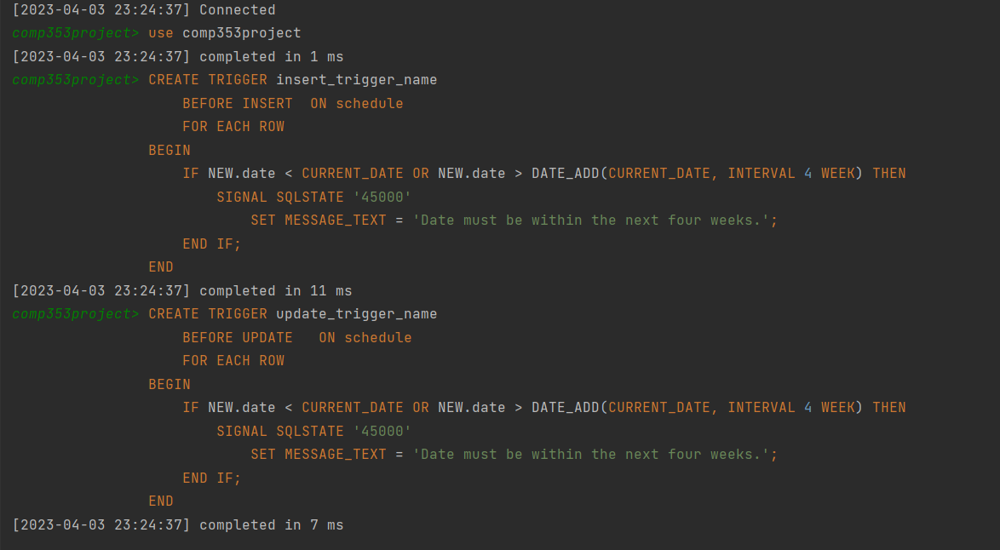

# Health Facility Employee Status Tracking System
***

The Health Facility Employee Status Tracking System website is primarily built using PHP and MySQL, and it extensively employs various SQL functionalities.

## Author 
***
Zilin Xu
***
## Content
- [Features](#features)
- [E/R Diagram](#er-diagram)
- [Evaluate the SQL, DDL and DML commands](#evaluate-the-sql-ddl-and-dml-commands)
    - [Events](#events)
    - [Trigger](#trigger)
- [E/R to Relation conversion](#er-to-relation-conversion)
- [Normalization Process Details](#normalization-process-details)

## Features
***
- 	**Frontend Development:** Leveraged Bootstrap and PHP to design and implement 
    the user interface of the Health Facility Employee Status Tracking System, 
    ensuring a responsive and intuitive user experience.
-   **Database Design:** Utilized Entity-Relationship Diagrams (ERD) to architect the underlying MySQL database, ensuring efficient data organization and relationship mapping to support complex queries and operations.
- **Backend Functionality:** Implemented CRUD operations to enable comprehensive data management within the system. Employed MySQL triggers for real-time alert emails upon specific data conditions and configured MySQL events for automated, scheduled email dispatches.

## E/R Diagram:
***


## Evaluate the SQL, DDL and DML commands
***
**1. Create/Delete/Edit/Display a Facility.**

**Create query**

```
CREATE TABLE Facility (

name VARCHAR(20)NOT NULL ,

address VARCHAR(45),

city VARCHAR(45),

province VARCHAR(45),

postal-code VARCHAR(45),

phone number INT,

web address` VARCHAR(20),

type VARCHAR(20),

capacity INT,

PRIMARY KEY (name)

);
```

**Delete query**

`DELETE FROM facilities AS facilities WHERE name= new\_name`

**Create query**

```
UPDATE facilities SET address=new\_address, city=new\_city,

province=new\_province, postal\_code=new\_postal\_code, phone\_number=new\_phone\_number, web\_address=new\_web\_address, type=new\_type, capacity=new\_capacity

WHERE name =new\_name;
```

**2. Create/Delete/Edit/Display an Employee.**

**Create query**

```
CREATE TABLE Employees(

MCN INT NOT NULL,

first-name VARCHAR(45),

last-name VARCHAR(45),

date of birth DATETIME,

telephone number INT,

address VARCHAR(45),

city VARCHAR(45),

province VARCHAR(45),

postal-code VARCHAR(45),

citizenship VARCHAR(45),

email-address VARCHAR(45)

PRIMARY KEY (MCN)

);
```

**Delete query**

```
DELETE FROM employees WHERE MCN= input\_MCN
```

**Edit query**

```
UPDATE employees SET first\_name=new\_first\_name, last\_name=new\_last\_name, date\_of\_birth=new\_date\_of\_birth,

telephone\_number=new\_telephone\_number, address=new\_address, city=new\_city, province=new\_province, postal\_code=new\_postal\_code,

citizenship=new\_citizenship, email\_address=new\_email\_address

WHERE MCN = new\_MCN
```

**3. Create/Delete/Edit/Display a Vaccination.**

**Create query**

```
CREATE TABLE Vaccination(

MCN INT NOT NULL,

dose INT NOT NULL,

date DATETIME,

location VARCHAR(45),

type VARCHAR(45)

PRIMARY KEY (MCN, dose));
```

**Edit query**

```
UPDATE vaccination SET location= new\_location, type=new\_type, dose=new\_dose,

date=new\_date WHERE MCN =new\_MCN;
```

**Delete query**

```
DELETE FROM vaccination WHERE MCN= new\_MCN
```

**4. Create/Delete/Edit/Display an Infection.**

**Create query**

```
CREATE TABLE Infection\_history

(

MCN INT NOT NULL,

date DATETIME NOT NULL,

times INT,

type VARCHAR(45),

PRIMARY KEY (MCN, date));
```

**Edit query**

```
UPDATE infection\_history SET type=new\_type, times=new\_times,

date=new\_date WHERE MCN =new\_MCN
```

**Delete query**

```
DELETE FROM infection\_history WHERE MCN= new\_MCN
```

**5. Assign/Delete/Edit schedule for an Employee. (Attempt to schedule a**

**conflicting assignment for an employee)**

```
CREATE TABLE schedule

(

MCN INT NOT NULL,

name VARCHAR(45) NOT NULL,

startTime TIME,

endTime TIME

date DATE,

PRIMARY KEY (MCN, name));
```

**Assign**

```
INSERT INTO schedule (reference\_number, MCN, date, name, startTime, endTime )

VALUES(new\_reference\_number, new\_MCN, new\_date, new\_name, new\_startTime, new\_endTime)
```

**Delete**

```
DELETE FROM schedule WHERE reference\_number= new\_reference\_number
```

**Edit**

```
UPDATE schedule SET MCN=new\_MCN, name=new\_name, date=new\_date, startTime=new\_startTime,

endTime=new\_endTime WHERE reference\_number = new\_reference\_number;
```

**6. Get details of all the facilities in the system. Details include the facility's name, address, city, province, postal-code, phone number, web address, type, capacity, general manager's name and number of employees currently working for the facility. Results should be displayed sorted in ascending order by province, then by city, then by type, then by number of employees currently working for the facility.**

```
SELECT

f.name, f.address, f.city, f.province, f.postal\_code, f.phone\_number, f.web\_address, f.type, f.capacity,

CONCAT(e.first\_name, ' ', e.last\_name) AS general\_manager\_name,

COUNT(w.MCN) AS number\_of\_employees

FROM facilities f

LEFT JOIN workat w ON f.type = w.Ftype AND f.name = w.Fname AND f.address = w.Faddress AND w.end\_time IS NULL

LEFT JOIN (SELECT Ftype, Fname, Faddress, MCN FROM workat WHERE role = 'administrative personnel') AS mgr ON f.type = mgr.Ftype AND f.name = mgr.Fname AND f.address = mgr.Faddress

LEFT JOIN employees e ON mgr.MCN = e.MCN

GROUP BY f.name, f.address, f.city, f.province, f.postal\_code, f.phone\_number, f.web\_address, f.type, f.capacity, general\_manager\_name

ORDER BY f.province ASC, f.city ASC, f.type ASC, number\_of\_employees ASC;
```
**7. Get details of all the employees currently working in a specific facility. Details include employee's first-name, last-name, start date of work, date of birth, Medicare card number, telephone-number, address, city, province, postal-code, citizenship, and email address. Results should be displayed sorted in ascending order by role, then by first name, then by last name.**

```
SELECT e.first\_name, e.last\_name, w.start\_time, e.date\_of\_birth, e.MCN, e.telephone\_number, e.address, e.city, e.province, e.postal\_code, e.citizenship, e.email\_address

FROM employees e

INNER JOIN workat w ON e.MCN = w.MCN

WHERE w.Fname = Evergreen CLSC AND w.end\_time IS NULL

ORDER BY w.role ASC, e.first\_name ASC, e.last\_name ASC;
```

**8. For a given employee, get the details of all the schedules she/he has been scheduled during a specific period of time. Details include facility name, day of the year, start time and end time. Results should be displayed sorted in ascending order by facility name, then by day of the year, then by start time.**

```
SELECT name, date, startTime, endTime

FROM schedule

WHERE MCN = new\_MCN AND date BETWEEN "2022-02-02" AND "2023-08-01"

ORDER BY name ASC, date ASC, startTime ASC
```

**9. Get details of all the doctors who have been infected by COVID-19 in the past two weeks. Details include the doctor's first-name, last-name, date of infection, and the name of the facility that the doctor is currently working for. Results should be displayed sorted in ascending order by the facility name, then by the first-name of the doctor.**

```
SELECT e.first\_name, e.last\_name, ih.date, w.Fname

FROM employees e

JOIN workat w ON e.MCN = w.MCN

JOIN infection\_history ih ON e.MCN = ih.MCN

WHERE w.role = 'Doctor'

AND ih.type = 'COVID-19'

AND ih.date \>= DATE\_SUB(CURDATE(), INTERVAL 2 WEEK)

ORDER BY w.Fname ASC, e.first\_name ASC;
```


**10. List the emails generated by a given facility. The results should be displayed in ascending order by the date of the emails.**

`SELECT\*FROM email`

**11. For a given facility, generate a list of all the doctors and nurses who have been on schedule to work in the last two weeks. The list should include first-name, last-name, and role. Results should be displayed in ascending order by role, then by first name.**

```
SELECT DISTINCT employees.first\_name, employees.last\_name, workat.role

FROM employees

JOIN workat ON employees.MCN = workat.MCN

JOIN schedule ON workat.MCN = schedule.MCN

WHERE workat.Fname = "Hopital Maisonneuve Rosemont" AND schedule.date \>= DATE\_SUB(CURDATE(), INTERVAL 2 WEEK) AND workat.role IN ('Doctor', 'Nurse')

GROUP BY employees.first\_name, employees.last\_name, workat.role

ORDER BY workat.role ASC, employees.first\_name ASC
```

**12. For a given facility, give the total hours scheduled for every role during a specific period. Results should be displayed in ascending order by role.**

```
SELECT workat.role,SUM(TIME\_TO\_SEC(TIMEDIFF(schedule.endTime, schedule.startTime))) / 3600 AS total\_hours

FROM schedule

JOIN workat ON schedule.MCN = workat.MCN

WHERE workat.Fname = "Hospital Maisonneuve Rosemont" AND schedule.name = "Hospital Maisonneuve Rosemont"

GROUP BY workat.role

ORDER BY workat.role ASC
```


**13. For every facility, provide the province where the facility is located, the facility name, the capacity of the facility, and the total number of employees in the facility who have been infected by COVID-19 in the past two weeks. The results should be displayed in ascending order by province, then by the total number of employees infected.**

```
SELECT f.province, f.name, f.capacity, COUNT(ih.MCN) AS infected\_count

FROM facilities f

LEFT JOIN workat w ON f.name = w.Fname AND f.address = w.Faddress AND f.type = w.Ftype

LEFT JOIN infection\_history ih ON w.MCN = ih.MCN

WHERE ih.type = 'COVID-19' AND ih.date \>= DATE\_SUB(CURDATE(), INTERVAL 2 WEEK)

GROUP BY f.name,f.province,f.capacity

ORDER BY f.province ASC, infected\_count ASC;
```

**14. For every doctor who is currently working in the province of "Québec", provide the doctor's first-name, last-name, the city of residence of the doctor, and the total number of facilities the doctor is currently working for. Results should be displayed in ascending order by city, then in descending order by total number of facilities.**

```
SELECT e.first\_name, e.last\_name, e.city as city\_of\_residence,count(e.MCN) as facility\_count

FROM employees e

JOIN workat w ON e.MCN = w.MCN

WHERE w.role = 'Doctor' AND w.Faddress IN (

SELECT address

FROM facilities a

WHERE province = 'Québec'

)and (w.end\_time IS NULL OR w.end\_time \> CURRENT\_DATE)

group by e.first\_name, e.last\_name, e.city,e.MCN,province

ORDER BY e.city ASC, facility\_count DESC
```


**15. Get details of the nurse(s) who is/are currently working and has the highest number of hours scheduled in the system since they started working as a nurse. Details include first-name, last-name, first day of work as a nurse, date of birth, email address, and total number of hours scheduled.**

```
SELECT e.first\_name, e.last\_name, MIN(w.start\_time) AS first\_day\_work, e.date\_of\_birth, e.email\_address, SUM(TIMESTAMPDIFF(HOUR, s.startTime, s.endTime)) AS total\_hours\_scheduled

FROM employees e

JOIN workat w ON e.MCN = w.MCN

JOIN schedule s ON e.MCN = s.MCN

WHERE w.role = 'Nurse' AND w.start\_time = (

SELECT MAX(w2.start\_time)

FROM workat w2

WHERE w2.MCN = e.MCN AND w2.role = 'Nurse'

) AND (w.end\_time IS NULL OR w.end\_time \> CURRENT\_DATE)

GROUP BY e.MCN, e.first\_name, e.last\_name, e.date\_of\_birth, e.email\_address

ORDER BY total\_hours\_scheduled DESC

LIMIT 1;
```

**16. Get details of the nurse(s) or the doctor(s) who are currently working and has been infected by COVID-19 at least three times. Details include first-name, last-name, first day of work as a nurse or as a doctor, role (nurse/doctor), date of birth, email address, and total number of hours scheduled. Results should be displayed sorted in ascending order by role, then by first name, then by last name.**

```
SELECT e.first\_name, e.last\_name, MIN(w.start\_time) AS first\_day\_work, w.role, e.date\_of\_birth, e.email\_address, SUM(TIMESTAMPDIFF(HOUR, s.startTime, s.endTime)) AS total\_hours\_scheduled

FROM employees e

JOIN workat w ON e.MCN = w.MCN

JOIN infection\_history ih ON e.MCN = ih.MCN

JOIN schedule s ON e.MCN = w.MCN

WHERE w.role IN ('Nurse', 'Doctor') AND ih.type = 'COVID-19'

GROUP BY e.MCN,e.first\_name, e.last\_name, e.date\_of\_birth, e.email\_address,w.role

HAVING COUNT(ih.times) \>= 3

ORDER BY w.role ASC, e.first\_name ASC, e.last\_name ASC;
```


**17. Get details of the nurse(s) or doctor(s) who are currently working and has never been infected by COVID-19. Details include first-name, last-name, first day of work as a nurse or as a doctor, role (nurse/doctor), date of birth, email address, and total number of hours scheduled. Results should be displayed sorted in ascending order by role, then by first name, then by last name**

```
SELECT e.first\_name, e.last\_name, MIN(w.start\_time) AS first\_day\_work, w.role, e.date\_of\_birth, e.email\_address, SUM(TIMESTAMPDIFF(HOUR, s.startTime, s.endTime)) AS total\_hours\_scheduled

FROM employees e

JOIN workat w ON e.MCN = w.MCN

INNER JOIN schedule s ON e.MCN = s.MCN

WHERE w.role IN ('Nurse', 'Doctor') AND e.MCN IN (

SELECT MCN

FROM infection\_history

WHERE type = 'COVID-19' AND times\>=3

) AND (w.end\_time IS NULL OR w.end\_time \> CURRENT\_DATE)

GROUP BY e.MCN, e.first\_name, e.last\_name, w.role, e.date\_of\_birth, e.email\_address

ORDER BY w.role ASC, e.first\_name ASC, e.last\_name ASC;
```

### Events

1. **Sunday Email**

```
DELIMITER //

CREATE PROCEDURE UpdateEmailTable()

BEGIN

INSERT INTO email (date, fName, eEmail, body, emailSubject)

SELECT s.date,

w.Fname,

e.email\_address,

CONCAT( w.Fname,'\n', s.startTime, '\n', s.endTime) AS body,

'Weekly Schedule' AS emailSubject

FROM schedule s

JOIN workat w ON s.MCN = w.MCN

JOIN employees e ON s.MCN = e.MCN

WHERE

s.date \>= CURDATE() AND s.date \< CURDATE() + INTERVAL 2 WEEK;

END //

DELIMITER ;

CREATE EVENT update\_email\_table\_event

ON SCHEDULE EVERY 1 WEEK STARTS '2023-04-09 00:00:00'

DO

CALL UpdateEmailTable();
```

### Trigger

1. **Warning Email**


2. **Schedule must within the next 4 weeks**
   

3. **Employee can not schedule without 6-month vaccine**
   


4. **Cannot schedule a nurse or doctor to work within two weeks of COVID-19 infection**
   

## E/R to Relation conversion
***
**Facilities (name, type, address, city, province, postal\_code, phone\_number, web\_address, capacity)**

**Key:** name

**FD:** {name → address, city, province, postal\_code, phone\_number, web\_address, capacity }

In relation Facilities, we assume the name is unique, hence name is the primary key in Facilities.

**WorkAt (name, MCN, **** role, start\_time, end\_time)**

**Key** :name, MCN

**FD:** {name, MCN→ role, start\_time, end\_time }

**Constraints:** A new employee cannot be assigned to a facility if the current total number of employees currently working for the facility is equal to the capacity of the facility

Since WorkAt is a many to many relation between Employees and Facilities, both keys of two relations need to form a key of relation WorkAt.

**Schedule (****reference\_number****, name, MCN, date, start\_time, end\_time)**

**Key:** reference\_number

**FD:** {reference\_number→ name, MCN, date, start\_time, end\_time }

**Constraints:** Start time less than the end time. An employee cannot be scheduled at two different conflicting times neither at the same facility nor at different facilities. If a nurse or a doctor is infected by COVID-19, then he/she cannot be scheduled to work for at least two weeks from the date of infection. An employee cannot be scheduled if she/he is not vaccinated, at least one vaccine for COVID-19 in the past six months prior to the date of the new schedule.

In relation Schedule, we set the reference number as unique, hence the reference number is the primary key in Facilities.

**Employees (****MCN****, first\_name, last\_name, date\_of\_birth, telephone\_number, address, city, province, postal\_code, citizenship, email\_address).**

**Key:** MCN

**FD:** {MCN → first\_name, last\_name, date\_of\_birth, telephone\_number, address, city, province, postal\_code, citizenship, email\_address}

Every employee has a unique MCN and it can not be null, hence, MCNis the only primary key in Employees.

**Infection\_history** (MCN, date, type, times)

**Key:** MCN, date

**FD:** {MCN, date → type, times}

Infection\_history is a weak entity set, so the key of Infection\_history needs to be a discriminator which is date combined with the key from the strong entity set which is MCN to form a key of Infection\_history.

**Vaccination(MCN, dose,type,location,date)**

**Key** : MCN, dose,type

**FD:** {MCN, dose, type → location, date}

Vaccination is a weak entity set, so the key of Vaccination needs to be a discriminator which is combined with the key from the strong entity set which is MCN to form a key of Vaccination

**Email** (date, name, emailSubject, eEmail, body,)

**Key** : date, name, emailSubject,

**FD:** {date, name, emailSubject →eEmail, body}

Table Email is used to store the history of all emails sent by the system. Date, name, and email Subject bonded together to form a primary key which can search for specific email that was sent.

## Normalization Process Details
***
Normalization Process Details

Show the relation is 3NF, we need to check the at least one of the following holds:

1. The left hand side of each nontrivial FD is a superkey
2. The right hand side is part of any key of R

Show the relation is BCNF, we need to check:

1. The left hand side of each nontrivial FD is a superkey

We will test every table is in 3NF and possibly in BCNF:

**Facilities (type, name, address, city, province, postal\_code, phone\_number, web\_address, capacity)**

FDs: {name → address, city, province, postal\_code, phone\_number, web\_address, capacity }

{name}+ = Facilities

For the only FD in Facilities, the left hand side is a key.

Hence, the relation is in BCNF

**WorkAt (Fname, MCN, role, start\_time, end\_time)**

FD: {name, MCN→ role, start\_time, end\_time }

{name, MCN}+ = WorkAt

Since every FD in ManagedBy, the left hand side is a key.

Hence, the relation is in BCNF

**Schedule (reference\_number, name, MCN, role, start\_time, end\_time)**

FD: {reference\_number→ name, MCN, role, start\_time, end\_time}

{reference\_number}+ = HistorySchedule

Since every FD in Schedule, the left hand side is a key.

Hence, the relation is in BCNF

**Employees (MCN, first\_name, last\_name, date\_of\_birth, telephone\_number, address, city, province, postal\_code, citizenship, email\_address).**

FD: {MCN → first\_name, last\_name, date\_of\_birth, telephone\_number, address, city, province, postal\_code, citizenship, email\_address}

{MCN}+ = Employees

Since every FD in Employees, the left hand side is a key.

Hence, the relation is in BCNF

**Vaccination (MCN, dose, type,location, date)**

FD: {MCN, dose, type → location, date}

{MCN, dose, type}+ = Vaccination

Since every FD in Vaccination, the left hand side is a key.

Hence, the relation is in BCNF

**Infection\_history (MCN, date,type, times )**

FD: {MCN, date → type, times}

{MCN, date}+ = Infection\_history

Since every FD in Infection\_history, the left hand side is a key.

Hence, the relation is in BCNF

Therefore, for every FDs in each relation, we have proved that all relations are in BCNF which means they are also in 3NF.
